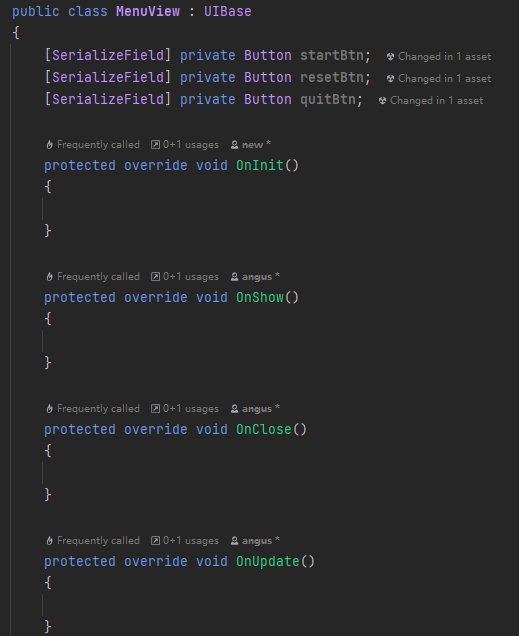
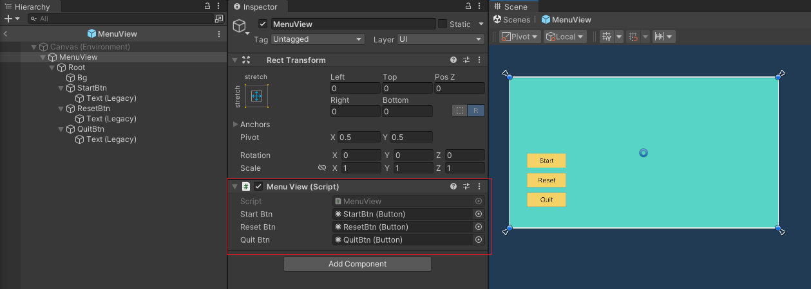
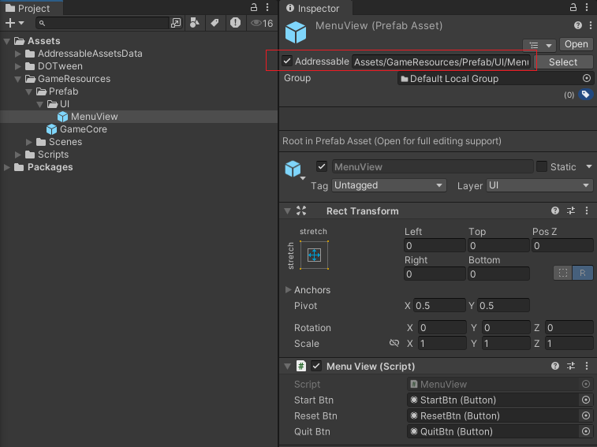
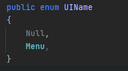
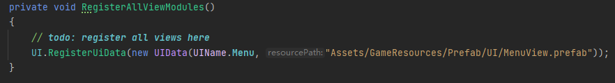
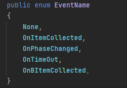
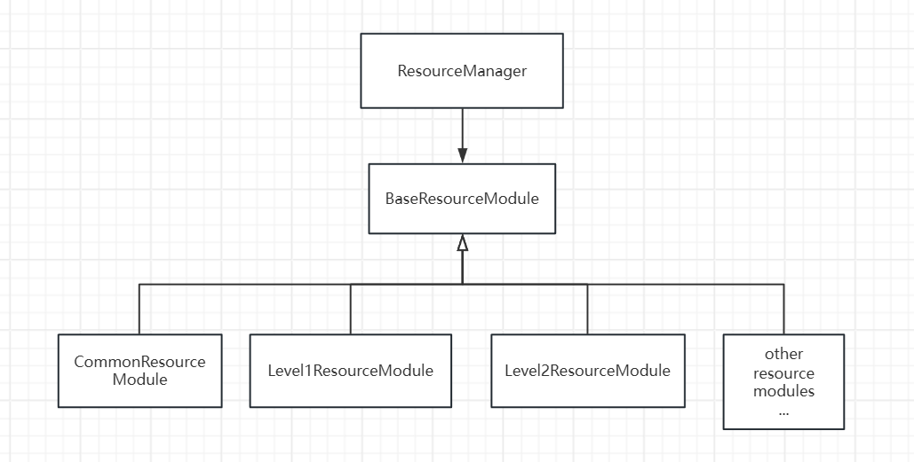
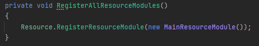
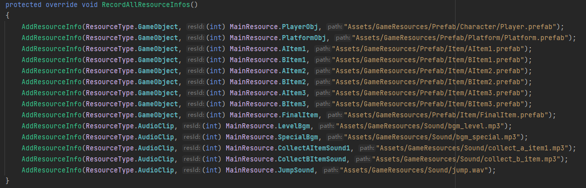

# 01 UIManager

To add a new ui:
1. create a ui script derived from `UIBase` class which provides basic lifecycle methods.
	
2. create a ui prefab and attach the ui script to it.
	
3. make sure the Addressable button on the ui prefab is toggled
	
4. add a name for the new ui in `UIName.cs`
	
5. register the new ui at `GameCore_View.cs`
	

Then, in logic code, we can use these APIs to control the ui:
```
// open Menu panel at first layer, 
GameCore.UI.OpenUI(UILayer.First, UIName.Menu);

// close Menu panel
GameCore.UI.CloseUI(UIName.Menu);

// close all panels
GameCore.UI.CloseAll();

// fade out and fade in
GameCore.UI.TransitionFadeOut(() =>
{
	// load new scene and resources and balabala... 
	GameCore.UI.TransitionFadeIn();
});
```

# 02 EventManager
Every event should has a name in `EventName.cs`



Then, in logic code, we can use events through these APIs:
```
// register event
GameCore.Event.RegisterEvent(EventName.OnPhaseChanged, OnPhaseChanged);

// unregister event
GameCore.Event.UnRegisterEvent(EventName.OnPhaseChanged, OnPhaseChanged);

// broadcast event
GameCore.Event.DispatchNow(this, EventName.OnPhaseChanged);
```

# 03 ResourceManager



ResourceManager registers all the resouce modules at `GameCore_Resource.cs`



Every resource module registers its own resources at its method `RecordAllResourceInfos()`



Then, we can get access to resources like this:
```
// get a resource module from the ResourceManager
var resourceModule = GameCore.Resource.GetResourceModule<MainResourceModule>(ResourceModuleName.Main);

// get a resource from resource the module
var playerPrefab = resourceModule.GetRes<GameObject>(MainResource.PlayerObj);

// use the resource
var playerObj = Instantiate(playerPrefab);
...
```

# 04 SceneManager
```
GameCore.Scene.LoadSceneAsync("Assets/GameResources/Scenes/MenuScene.scene").Completed += handle =>  
{  
    if (handle.Status != AsyncOperationStatus.Succeeded)  
    {
	    return;  
    }
    
	// init the scene...
};
```

# 05 SoundManager
```
// play a AudioClip at Background layer, with volume = bgmVolume, pitch = 1f and isLoop = true
GameCore.Sound.Play(SoundLayer.Background, bgmClip, bgmVolume, 1f, true);

// stop all sounds in a layer
GameCore.Sound.StopSound(SoundLayer.Background);
```