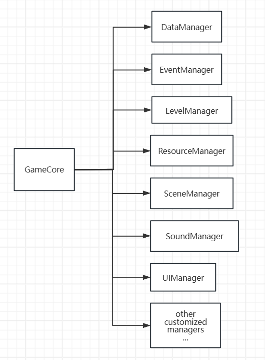

# Framework Structure

`GameCore` is the core of the entire framework, designed to access all global classes and initiate the game. It is a `MonoBehaviour` script attached to a GameObject. Global classes are also `MonoBehaviour` scripts, attached to the child objects of the GameObject where `GameCore` is located.

`GameCore` holds references to all global classes, enabling access to these classes in the code via `GameCore`.

# Global Classes
The framework currently includes the following global classes:

- **DataManager**: Handles data access and modification.
- **EventManager**: Registers and broadcasts events.
- **LevelManager**: Manages specific in-level logic.
- **ResourceManager**: Loads and releases resources.
- **SceneManager**: Handles scene transitions.
- **SoundManager**: Plays music and sound effects.
- **UIManager**: Manages opening and closing of UI interfaces.

Each manager comes with specific usage examples in the framework. You can also refer to my open-source demo, [_ForeverUp!_](https://github.com/AngusK97/Game_ForeverUp_NoPaidResourceVersion), for additional insights.

# Adding New Global Classes
1. Ensure the new global class inherits from `MonoBehaviour`.
2. Create a child object under the `GameCore` GameObject and attach the new global class script to it.
3. Add a variable for the new global class in `GameCore`.
4. Drag and drop the global class reference to `GameCore`.

# Discussion
If you have any questions or suggestions, feel free to reach out and discuss with me: **anguskungcn@foxmail.com**.
